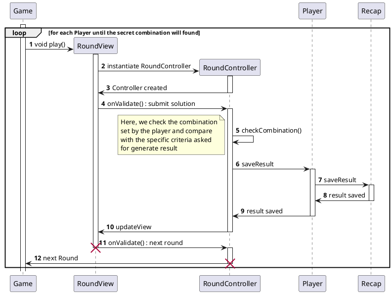

# Description de la manche

<primary-label ref="diagram"/>

## Description

La manche est une partie du jeu. Elle est composée de plusieurs éléments :
- Un **Game** : le contenu de la partie.
- Un **RoundController** : le contrôleur de la manche.
- Un **RoundView** : la vue de la manche.

A chaque manche, un joueur doit proposer une combinaison. Cette combinaison est testée et le résultat est affiché à l'écran.
Puis, le résultat de la manche est retourné au jeu.

### Modifications continue de la conception

Dans la première version de notre conception, nous avions prévu de créer une classe `Round` pour chaque manche.
Cependant, comme nous n'avons pas besoin de stocker tout les résultats des manches, nous avons décidé de ne pas créer de classe `Round` et de gérer les manches directement dans le contrôleur de la manche.
Et de stocker les résultats et les combinaisons dans la classe `Player`.

### Exemple

Un joueur propose la combinaison `123`. Pour un critère nombre de `1` le test renvoie `validé` (true), pour le critère le 3ᵉ nombre est le plus grand, le test renvoie `non validé` (false), et ainsi de suite pour le nombre de critères de la partie.
Enfin, le résultat de la manche est retourné au jeu.

## Diagramme de séquence

<secondary-label ref="comportemental"/>

