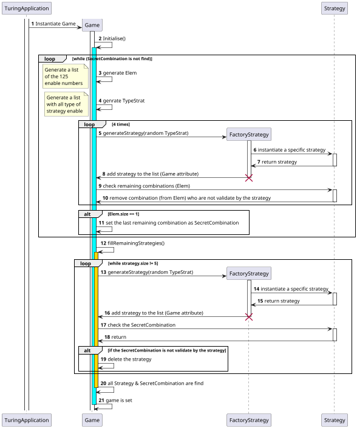

# Initialisation de la partie

<primary-label ref="diagram"/>

Le diagramme de séquence ci-dessous illustre les interactions entre les classes du système lors de l'initialisation de la partie. Il montre comment la classe `TuringApplication` instancie la classe `Game`, qui à son tour initialise le jeu en générant les stratégies et la solution.
Il met en évidence le rôle de notre algorithmie de génération de stratégies, notamment la validation des stratégies par rapport à la solution.

### Modifications continue de la conception

Cette partie n'a que peu évolué ormis certains ajouts de fonction afin de mieux séparer les responsabilités des méthodes.

## Diagramme de séquence

<secondary-label ref="comportemental"/>

